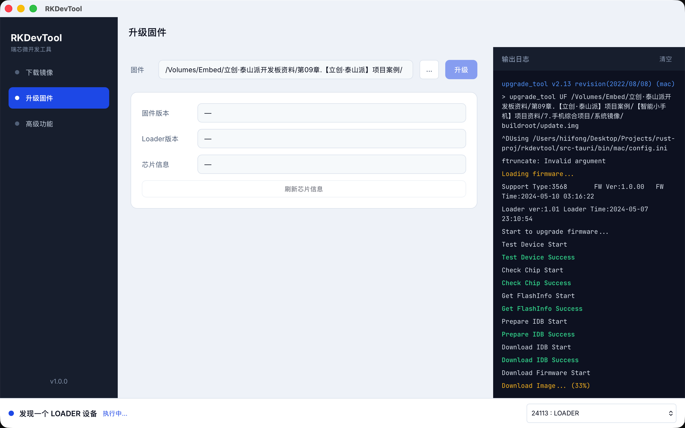
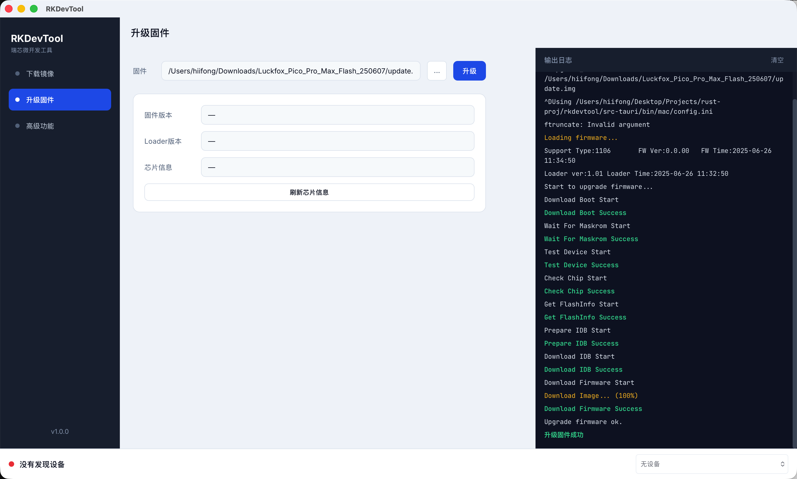

# RKDevTool

Cross-platform desktop GUI for Rockchip USB flashing, built with [Tauri 2](https://v2.tauri.app/) + Vue 3.

瑞芯微 USB 烧录工具的跨平台桌面 GUI，基于 Tauri 2 + Vue 3，封装官方命令行工具 `upgrade_tool`。

**[English](#english)** · **[中文](#中文)**

## Screenshots





---

## English

A modern alternative to the official Windows-only RKDevTool. Wraps `upgrade_tool` with real-time logs, device polling, and native builds for macOS, Windows, and Linux.

### Features

| Page | Description |
|------|-------------|
| **Download Image** | Flash Loader and partition images from a partition table; optional write-by-address |
| **Upgrade Firmware** | Full-package upgrade with `update.img` (UF command) |
| **Advanced** | Download Boot, extract firmware, read chip info, erase, reboot, switch storage, and more |

- Auto-poll RockUSB devices; status bar shows Maskrom / Loader mode
- Live log panel with in-place progress updates (`Download Image... (xx%)`)
- Switch target device from the status bar when multiple devices are connected

### Download

Get installers from [Releases](https://github.com/hiifong/rkdevtool/releases):

| Platform | Format |
|----------|--------|
| macOS | `.dmg` (Universal, signed + notarized) |
| Windows | `.exe` (NSIS installer) |
| Linux | `.AppImage` / `.deb` |

> CI Artifacts from `main` branch pushes are for development only. **macOS artifacts are not notarized** and cannot be opened by double-click. Use Release builds for distribution.

### Development

**Requirements**

- [Node.js](https://nodejs.org/) 18+
- [Rust](https://rustup.rs/) stable
- Platform deps: [Tauri prerequisites](https://v2.tauri.app/start/prerequisites/)

Linux extras:

```bash
sudo apt-get install libwebkit2gtk-4.1-dev libappindicator3-dev librsvg2-dev patchelf
```

**`upgrade_tool` binaries**

Place Rockchip SDK `upgrade_tool` files under:

```
src-tauri/bin/
├── mac/                 # upgrade_tool, config.ini, revision.txt
├── linux_x86-64/
└── windows_x86-64/
```

Use **v2.44+** when possible. The bundled Mac tool (v2.13) has incomplete support for newer chips (e.g. RK3576); copy a newer binary from the Linux/Windows SDK if needed.

**Run locally**

```bash
npm install
npm run tauri dev
```

**Build**

```bash
npm run tauri build
```

Output: `src-tauri/target/release/bundle/`

### Release (maintainers)

Pushing a `v*` tag triggers GitHub Actions to build all platforms and publish a Release:

```bash
git tag v0.1.0
git push origin v0.1.0
```

macOS signing & notarization secrets:

| Secret | Description |
|--------|-------------|
| `APPLE_CERTIFICATE` | **Developer ID Application** cert (.p12, base64) |
| `APPLE_CERTIFICATE_PASSWORD` | Password used when exporting .p12 |
| `KEYCHAIN_PASSWORD` | Temporary CI keychain password |
| `APPLE_ID` | Apple ID email |
| `APPLE_PASSWORD` | [App-specific password](https://appleid.apple.com) |
| `APPLE_TEAM_ID` | Developer Team ID |

### Tech stack

- **Frontend**: Vue 3 + TypeScript + Vite
- **Backend**: Rust (Tauri 2 commands, `upgrade_tool` subprocess)
- **Design**: Penpot specs in `design/`

---

## 中文

相比官方仅支持 Windows 的工具，RKDevTool 提供 macOS / Linux 原生版本，实时日志输出与现代界面。

### 功能

| 页面 | 说明 |
|------|------|
| **下载镜像** | 按分区表烧录 Loader / 各分区镜像，支持按地址写入 |
| **升级固件** | 使用 `update.img` 整包升级（UF） |
| **高级功能** | 下载 Boot、解包固件、读取芯片信息，以及擦除、重启、切换存储等操作 |

- 自动轮询 RockUSB 设备，状态栏显示当前连接模式（Maskrom / Loader）
- 实时日志面板，进度行原地刷新（`Download Image... (xx%)`）
- 多设备时可在状态栏切换目标设备

### 下载

在 [Releases](https://github.com/hiifong/rkdevtool/releases) 获取安装包：

| 平台 | 格式 |
|------|------|
| macOS | `.dmg`（Universal，已签名 + 公证） |
| Windows | `.exe`（NSIS 安装包） |
| Linux | `.AppImage` / `.deb` |

> push `main` 分支的 CI Artifacts 仅供开发测试，**macOS 未公证，无法直接双击打开**。请从 Release 下载正式版。

### 开发

**环境要求**

- [Node.js](https://nodejs.org/) 18+
- [Rust](https://rustup.rs/) stable
- 平台依赖见 [Tauri 前置条件](https://v2.tauri.app/start/prerequisites/)

Linux 额外依赖：

```bash
sudo apt-get install libwebkit2gtk-4.1-dev libappindicator3-dev librsvg2-dev patchelf
```

**`upgrade_tool` 二进制**

开发/打包前，将瑞芯微 SDK 中的 `upgrade_tool` 放入对应目录：

```
src-tauri/bin/
├── mac/                 # upgrade_tool, config.ini, revision.txt
├── linux_x86-64/
└── windows_x86-64/
```

建议使用 **v2.44+** 版本。Mac 自带旧版（v2.13）对部分新芯片（如 RK3576）支持不完整，可从 Linux/Windows SDK 包中获取较新版本替换。

**本地运行**

```bash
npm install
npm run tauri dev
```

**构建**

```bash
npm run tauri build
```

产物位于 `src-tauri/target/release/bundle/`。

### 发布（维护者）

GitHub Actions 在 push `v*` tag 时自动构建三平台安装包并发布 Release：

```bash
git tag v0.1.0
git push origin v0.1.0
```

macOS 签名与公证需在仓库 Secrets 中配置：

| Secret | 说明 |
|--------|------|
| `APPLE_CERTIFICATE` | **Developer ID Application** 证书（.p12 base64） |
| `APPLE_CERTIFICATE_PASSWORD` | 导出 .p12 时的密码 |
| `KEYCHAIN_PASSWORD` | CI 临时钥匙串密码 |
| `APPLE_ID` | Apple ID 邮箱 |
| `APPLE_PASSWORD` | [应用专用密码](https://appleid.apple.com) |
| `APPLE_TEAM_ID` | Developer Team ID |

### 技术栈

- **前端**：Vue 3 + TypeScript + Vite
- **后端**：Rust（Tauri 2 命令，封装 `upgrade_tool` 子进程）
- **设计**：Penpot 设计稿，见 `design/`

---
